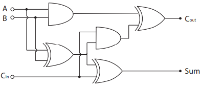
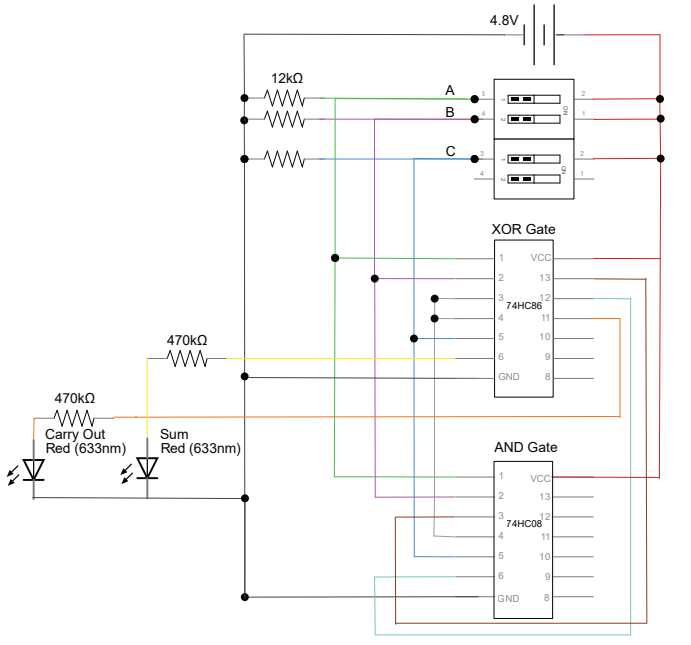
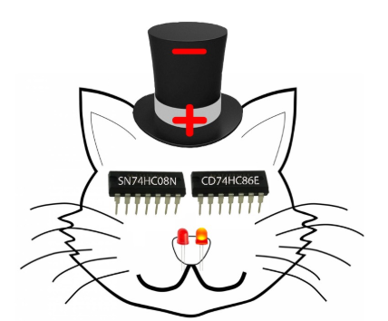
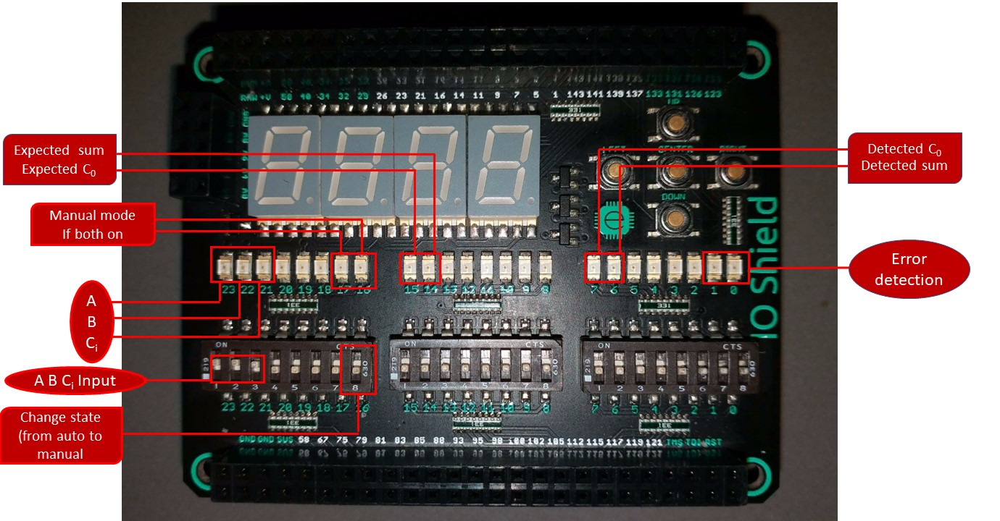

# FullBitAdder

**A + B + C = 2  Co + S**

## Truth Table

A | B | C | Co | S
------------ | ------------- | ------------- | ------------- | -------------
0 | 0 | 0 | 0 | 0
0 | 0 | 1 | 0 | 1
0 | 1 | 0 | 0 | 1
0 | 1 | 1 | 1 | 0
1 | 0 | 0 | 0 | 1
1 | 0 | 1 | 1 | 0
1 | 1 | 0 | 1 | 0
1 | 1 | 1 | 1 | 1

## Full Bit Adder using 2 ANDs and 3 XORs

  
  
  
  

> If you notice carefully, the Full Bit Adder above resembles a cat!

## Full Bit Adder + Mojo

Our Mojo have 3 different sections:
* First section, the first 3 leds represent A, B, C values and the button below as its inputs. The last 2 leds represent Auto or Manual state and the button below is the input.
> By default, the Mojo will be in Auto state. If the the button is on, it goes to Manual state and the 2 leds above it will light-up.
* Second section, the first 2 leds represent the expected sum and carrier of the A,B,C input
* Third section, the first 2 leds represent the detected output from the Full Bit Adder. The last 2 leds represent error which will light up if the Full Bit Adder is wrong or when the expected output is not the same with detected output.

**Auto**

In Auto mode, our FPGA will go through all 8 possible cases of A,B,C inputs to check our Full Adder

**Manual**

To switch to manual mode, toggle the button to on. We can see that 2 leds above the button light-up and we can input A,B,C as our desire.

**Error detection**

As you see, if the expected output is not equal to the expected output, the 2 led represents error will light up, which can be easily noticed.

## Components
* Strip Boards
* Wires
* MOJO V3
* IO-Shield
* SN74HC08N/AND gate
* CD74HC86E/XOR gate
* Led x2
* Switchs
* Battery 1.5V x4
* 12k Ohm resistor x3
* 470k Ohm resistor x2

## Software
* [MOJO IDE](https://alchitry.com/pages/mojo-ide)
* [ISE](https://alchitry.com/pages/installing-ise)

